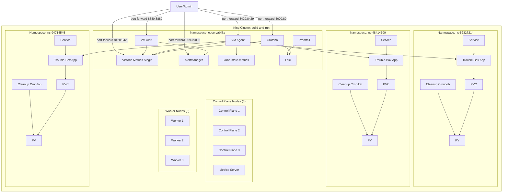

# build and run live demo

## Prerequisites

- Docker: https://docs.docker.com/engine/install/
- Kind: https://kind.sigs.k8s.io/
- kubectl: https://kubernetes.io/docs/tasks/tools/
- helm: https://helm.sh/docs/intro/install/
- Stern: https://github.com/stern/stern
- Kubectx & Kubens: https://github.com/ahmetb/kubectx

## Environment

- 3 nodes as control plane
- 3 nodes as workers

### Architecture Diagram



### Observability stack

- Grafana
- Victoria Metrics
- Loki
- Promtail
- Alertmanager
- kubestate metrics

### Workloads

Troublebox app

### Setting up

```bash
./deploy.sh
```

### Access

Grafana

Get pass:
kubectl get secret --namespace observability grafana -o jsonpath="{.data.admin-password}" | base64 --decode ; echo

kubectl port-forward -n observability svc/grafana 3000:80
url: http://localhost:3000

Victoria Metrics

kubectl port-forward -n observability svc/vmsingle-victoria-metrics-single-server 8428:8428
url: http://localhost:8428

Victoria Metrics vmagent

kubectl port-forward -n observability svc/vmagent 8429:8429
url: http://localhost:8429

Victoria Metrics vmalert
kubectl port-forward -n observability svc/vmalert-victoria-metrics-alert-server 8880:8880
url: http://localhost:8880

Alertmanager
kubectl port-forward -n observability svc/alertmanager 9093:9093
url: http://localhost:9093


